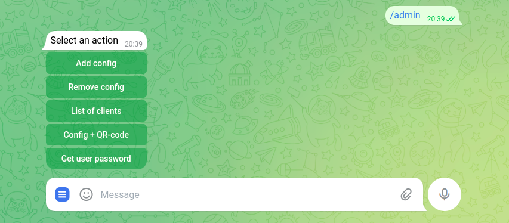
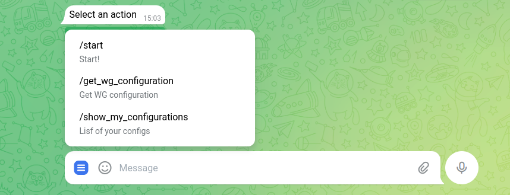
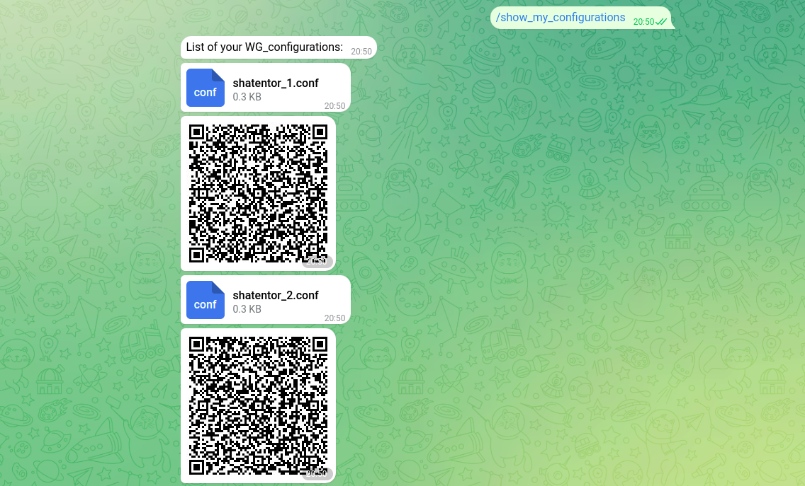

## Telegram bot for managing PiVPN WireGuard clients.

## Description 
Allows you to get your own VPN service! 
After PiVPN installation on your remote server, through this bot you can create, delete clients and get configuration files with qr-codes.
Also, other users can get VPN configs if they have a password ;) . 
Bot makes your work with PiVPN easier and more convenient.


## Instlallation
1. In case you have your personal server (if no, you should to get one), you need to install WireGuard and PiVPN:
    ```
   sudo apt update
   sudo apt upgrade
   sudo apt install wireguard
   curl -L https://install.pivpn.io | bash
   ```
   
2. The PiVPN installation wizard will guide you through the setup process. Follow the prompts to configure WireGuard and PiVPN according to your preferences.
Also start WireGuard Service if it is not already running:
   ```
   sudo systemctl start wg-quick@wg0
   ```
   
    Additionally, enable the service to start on boot:
    ```        
    sudo systemctl enable wg-quick@wg0
    ```     

3. Clone repository:
    ```
    git clone https://github.com/shatentor/vpn_bot.git
    cd vpn_bot
    ```
4. Install requirements:
    ```
    pip install -r requirements.txt
    ```
   
5. Update file "config.py" with your token Telegram API.
6. Here I use MariaDB to store all data (becuse I worked with it at University). To install:
   ```
   sudo apt install mariadb-server
   sudo systemctl start mariadb
   sudo systemctl enable mariadb
   ```  
   Now you need to create template of tables that I use:

    ```
   CREATE TABLE IF NOT EXISTS users (
    username VARCHAR(255),
    gained_access TIMESTAMP ,
    current_pass VARCHAR(255),
    chat_id VARCHAR(255),
    number_of_configs INT
    );

   CREATE TABLE IF NOT EXISTS configs_dates (
    username VARCHAR(255),
    config_1 DATETIME,
    config_2 DATETIME,
    config_3 DATETIME,
    config_4 DATETIME,
    chat_id INT
    );
    ```
7. Update file "mariadb_conn.py" with your data.
8. Update file "admin_commads.py" with your admin nickname.


## Usage
There are two types of users in bot: admin and other users.

- It is administrator`s commands:
Admin can get any configuration by its name: "Config + QR-code"


- And here other user`s commands: 

   User can get new config after entering the password (admin have it) or can get all his configurations:


  
## License 
This project licenced by Apache License Version 2.0 - look file [LICENSE](LICENSE).

## Contribution 
Now I am a beginner in programming world and want to receive a lot of new knowledge.
So it will be great to read your response on this bot. Moreover, I ask you to report about bags or mistakes. 
If you want to contribute in the project as a programmer or give me some advices (they can touch any theme),
it is great and I`ll be thankful. 

I think that this bot popularize the idea of using personal VPN that is a really important thing nowadays.
It helps us to stay anonymous and be more secure.
## Contact 
You can contact with me using email: shatentor66@gamil.com.
## Project status 
In developing.